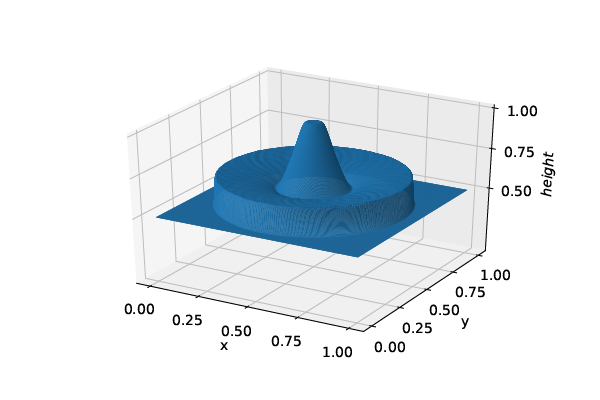

# higher_order_CWENO_boundary_treatment 



## Motivation

This repository provides a numpy-based implementation of a one-sided higher order polynomial reconstruction algorithm based on so called central weighted essentially non-oscillatory (CWENO) reconstructions.

It is based on the work *NAUMANN, Alexander; KOLB, Oliver; SEMPLICE, Matteo. On a third order CWENO boundary treatment with application to networks of hyperbolic conservation laws. Applied Mathematics and Computation, 2018, 325. Jg., S. 252-270.* and takes the presented one dimensional 3rd order approach to higher orders of 5 and 7. It also provides two dimensional implementations by applying the one dimensional approach independently in each dimension.

## Applications

Such reconstruction algorithms can for example be used to construct high-order Finite Volume schemes to solve systems of balance laws or conservation laws. Those arise from a variety of physical phenomena.

To assist with such applications, the repository implements explicit
Runge-Kutta time integrators of order 3, 5, and 7 as well as methods
to semi-discretize in spatial dimensions.

## Contributing

Contributions are always welcome. You can either pick an [existing issue](https://github.com/SvoONs/higher_order_CWENO_boundary_treatment/issues) or create a new one.

In order to work on an issue just fork the repository and open a pull request once ready. Generally that means:
* all tests pass and
* if new functionality is added, corresponding tests are part of the pull request.

### Development setup & running tests
In order to run tests locally you can run
```bash
pip install -r requirements.txt -r test-requirements.txt
pip install -e .
```
from the source directory to first install all requirements and setup the repository in editable mode. If you prefer conda over pip use the equivalent commands to achieve the same.

If everything worked fine, you can run tests using [pytest](https://docs.pytest.org/en/stable/):

```bash
pytest tests/
```

### Code formatting
I use [black](https://github.com/psf/black) for code formatting. To automatically run black whenever you commit a change install the provided pre-commit hooks by running
```bash
pre-commit install
```
Afterwards you can also manually format the code executing for example
```bash
pre-commit run --all-files
```
